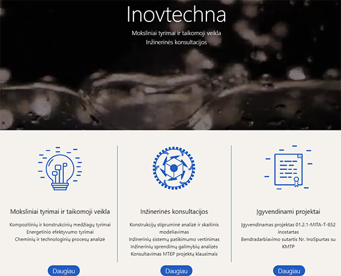
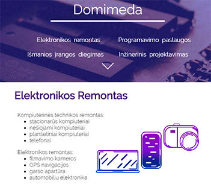
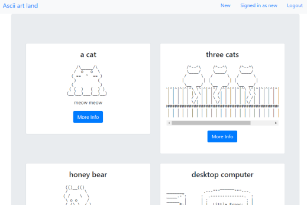
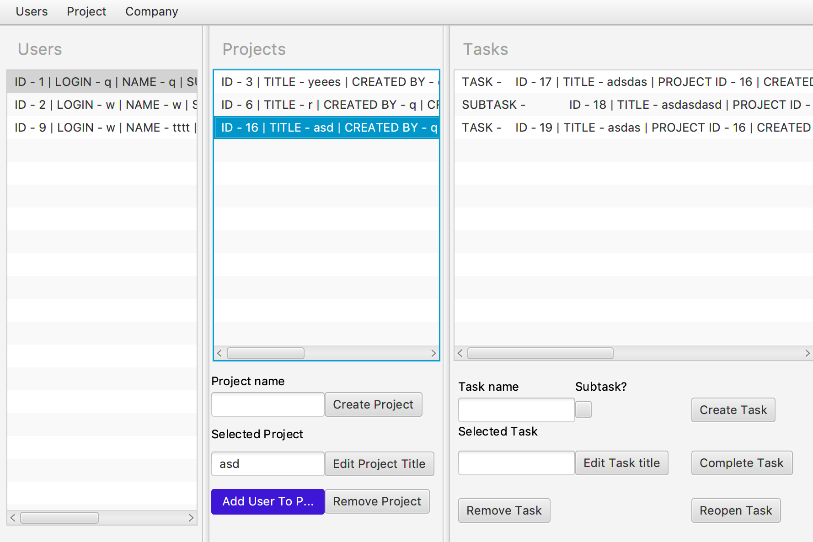
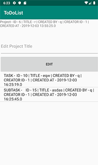
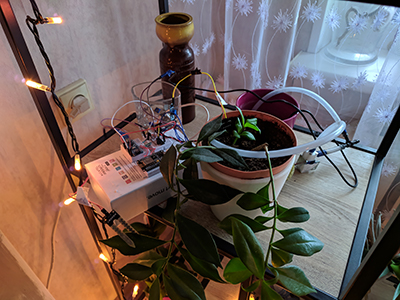
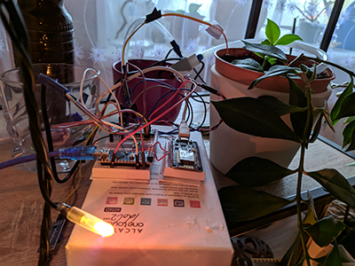

## Short personal info

Name: Laimonas Janutėnas 
 
Age: 21 
 
Occupation: Student (Vilnius Gediminas Technical University)
 
Currently studying: Software Engineering (Bachelor's degree) 
 

# Personal projects and hobbies

Most of these projects are unfinished, but I am still proud to show these projects since they took quite some time and effort. I have learned a lot doing these projects and I am happy to show what I have learned. 
 
 
[Github Profile](https://github.com/katinas15) - most of my projects are here (but some projects shown here are in private repos).
 

## Simple Unity C# games

I recetly completed an online course learned how to use Unity and make games. The games I made are simple and unfinished, but they are a great start for me.
 

<b>Block Hopper</b> - is my most recent project. This is a project I intend to finish by myself and release someday. Most difficult challenge for me was creating pixel art rather than programming. Learning art is a completely different experience for me, but with a lot of time I finally grasped the basics of how to make something decent (at least for me).
 
  

    
     
    Block Hopper
     
    <a href="https://katinas15.itch.io/blockhopperkatinas">Game DEMO</a>
  

 

<b>Labyrinth crawler</b> - was a group project for my university, I was responsible of programming the game. Main goal of the game is to find a way out of the labyrinth using various tool and fighting simple enemies. This was my first real project after completing the online course. 
 
  

    
     
    Labirynth Crawler
     
    <a href="https://github.com/katinas15/Labyrinth_crawler">Game git repository</a>
     
    <a href="https://katinas15.itch.io/katinaslabyrinthcrawlerdemo">Game DEMO</a>
  

## Websites

After learning how to make websites and create web designs I was able to make a little bit of money by making few simple static websites.

 
  

    
     
    Inovtechna
     
    <a href="http://inovtechna.lt/">Link to website</a>
  

  
 
  
  

    
     
    Domimeda
     
    <a href="https://domimeda.com/">Link to website</a>
  

  
### Node.js

<b>Ascii art land</b> - is a similar project that I build during my online course. It is a dynamic website, that lets user login, create new posts, edit and delete them (CRUD). My future goal for this project is to add a fully working online ascii art editor. Something similar to "Paint", but for text art.

  

    
     
    Ascii art land
     
    <a href="https://ascii-art-land.herokuapp.com/">Link to website (DEMO)</a>
  

  
### PHP

## Java

One of my bigger projects in university was a to do list made in java using various technologies like:
* Hibernate
* Spring MVC
* Android

 
This is a more complex to do list that has users, project, tasks and companies. Projects can have users and tasks, companies can have users and projects. It is more like a group project management system, where every user in the project (or company) can see tasks, finish them, edit, create etc. This project has a dektop application, Web server and an Android application.

 

  

    
   
   Program for desktop
   

 
 

  
   
  Android app

 
<a href="https://github.com/katinas15/ToDoList-java-">To Do List git repository</a>

## Arduino

This is a project I have been working for quite a while. It is a automated gardening system made with Arduino. Not only you can water the plants, but also collect data about the plant, then monitor and maintain plants wirelessly (PHP server)!
 
 
Features:
- Check moisture of a plant
- Water plants using a pump
- Check if the water tank is empty
- Track how much water was poured
- Send sensor data to server (moisture, amounts of water, water tank status)
- Automatically connect to wifi (without embedding wifi name and password into code)
- Monitor and maintain the system wirelessly:
  - Initiate watering of all plants
  - Change the interval on how often the moisture should be checked
  - Immediately check current plant moisture status
  - Plant analysis - analyse how ofter the plant was watered during which period and etc. (in progress)
- Supports up to 8 plants! (currently, but it is possible to have even more!)
 
 
A lot has been done in this project, but there is still a lot to be done: cleaner code, better appearance (phisycal and digital), better analysis and more. My final goal is to make this system look like a full product.

 

  

    
   
   Arduino gardening system
   

   
 

  

    
   
   Arduino gardening system
   

## Other

[Codingame profile](https://www.codingame.com/profile/df8e16abde9b88d3623eaf9f7e13f8899915731) - programming puzzles
 
[Shutterstock Photos](https://www.shutterstock.com/g/laimisj?rid=177746324) - some photos that I took during vacations
 
