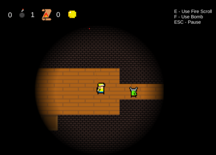

## Short personal info

Name: Laimonas Janutėnas  
Age: 21  
Occupation: Student, Vilnius Gediminas Technical University  
Studies: Bachelors degree, Software Engineering  

# Personal projects and hobbies

Most of these projects are unfinished, but I am still proud to show these projects since they took quite some time and effort. I have learned a lot doing these projects and I am happy to show what I have learned.  

## Simple Unity C# games

I recetly completed an online course learned how to use Unity and make games. The games I made are simple and unfinished, but they are a great start for me.
 

<b>Labyrinth crawler</b> - was a group project for my university, I was responsible of programming the game. Main goal of the game is to find a way out of the labyrinth using various tool and fighting simple enemies. This was my first real project after completing the course.  
  
[Labirynth crawler Demo](https://katinas15.itch.io/katinaslabyrinthcrawlerdemo)  

## Websites

